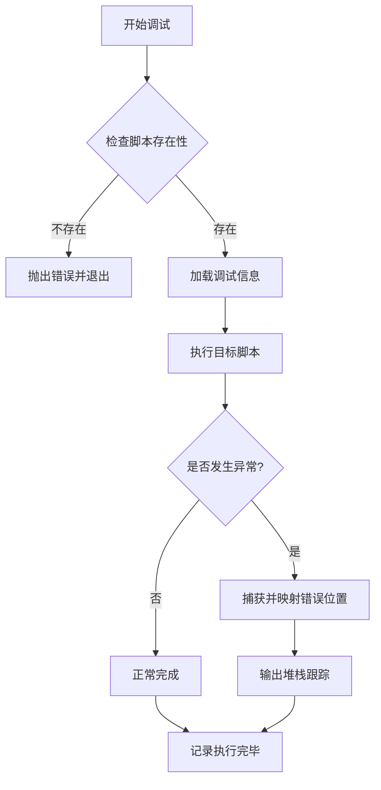

# <center>Infinity Debug 模块文档</center>

## <center>概述</center>

`infinity_dbg.ps1` 是一个 PowerShell 调试工具，专门用于调试由 `infinity_build.ps1` 生成的带有调试信息的项目。该工具提供错误位置映射、详细日志记录和执行监控功能。

## <center>功能特性</center>

<center>

| 功能 | 描述 |
|------|------|
| **脚本执行** | 运行打包的 PowerShell 脚本 |
| **错误捕获** | 自动捕获执行过程中的异常 |
| **位置映射** | 将错误位置映射回源文件（需要调试信息） |
| **详细日志** | 使用 Infinity Log 系统记录详细执行过程 |
| **参数传递** | 支持向目标脚本传递参数 |

</center>

## <center>参数说明</center>

### 必需参数

**`-ScriptPath`** (`[string]`)
- **描述**: 要调试的 PowerShell 脚本路径
- **必填**: 是
- **验证**: 不能为空或 null
- **示例**: `-ScriptPath "myapp.ps1"`

### 可选参数

**`-ArgumentList`** (`[array]`)
- **描述**: 传递给目标脚本的参数列表
- **必填**: 否
- **默认值**: 空数组 `@()`
- **示例**: `-ArgumentList "arg1", "arg2", "-Verbose"`

## <center>工作流程</center>



## <center>调试信息格式</center>

### 调试信息文件
- **文件名**: `<脚本名>.debug.json`
- **位置**: 与脚本文件相同目录
- **格式**: JSON 数组

### JSON 结构
```json
[
  {
    "SourceFile": "source.ps1",
    "SourceLineNum": 15,
    "OutputLine": 42
  },
  {
    "SourceFile": "utils.ps1", 
    "SourceLineNum": 8,
    "OutputLine": 56
  }
]
```

### 字段说明
<center>

| 字段名 | 类型 | 描述 |
|--------|------|------|
| `SourceFile` | `string` | 源文件路径（相对或绝对） |
| `SourceLineNum` | `int` | 源文件中的行号 |
| `OutputLine` | `int` | 打包后文件中的行号 |

</center>

## <center>日志输出</center>

### 日志级别
- **应用名**: `InfinityDbg`
- **启用彩色**: 是

### 典型日志输出
```
[2024-01-15 10:30:00][InfinityDbg][INFO-] 调试程序: myapp.ps1
[2024-01-15 10:30:00][InfinityDbg][INFO-] 已加载调试信息: myapp.debug.json
[2024-01-15 10:30:00][InfinityDbg][INFO-] 开始执行程序
[2024-01-15 10:30:00][InfinityDbg][INFO-] 参数列表: arg1 arg2
[2024-01-15 10:30:02][InfinityDbg][ERROR] 执行时发生错误: 文件未找到
[2024-01-15 10:30:02][InfinityDbg][INFO-] 调用堆栈跟踪:
[2024-01-15 10:30:02][InfinityDbg][DEBUG] at <ScriptBlock>, C:\path\to\myapp.ps1: line 42
[2024-01-15 10:30:02][InfinityDbg][INFO-]     -> at source.ps1: line 15
[2024-01-15 10:30:02][InfinityDbg][INFO-] 执行完毕
```

## <center>使用示例</center>

### 基本用法
```powershell
# 调试一个脚本（无参数）
.\infinity_dbg.ps1 -ScriptPath "build\myapp.ps1"

# 调试并传递参数
.\infinity_dbg.ps1 -ScriptPath "build\myapp.ps1" -ArgumentList "-Mode", "Debug", "-Verbose"

# 使用相对路径
.\infinity_dbg.ps1 -ScriptPath "..\output\test.ps1"
```

### 工作目录说明
```powershell
# 假设当前目录: C:\Projects\MyApp\
# 目标脚本位置: C:\Projects\MyApp\build\myapp.ps1

# 正确用法 - 相对路径
.\infinity_dbg.ps1 -ScriptPath "build\myapp.ps1"

# 正确用法 - 绝对路径  
.\infinity_dbg.ps1 -ScriptPath "C:\Projects\MyApp\build\myapp.ps1"

# 错误用法 - 路径不存在
.\infinity_dbg.ps1 -ScriptPath "nonexistent.ps1"
# 输出: [InfinityDbg][ERROR] 未找到程序: nonexistent.ps1
```

### 复杂参数传递
```powershell
# 传递开关参数
.\infinity_dbg.ps1 -ScriptPath "app.ps1" -ArgumentList "-Force", "-Confirm:$false"

# 传递位置参数和命名参数混合
.\infinity_dbg.ps1 -ScriptPath "app.ps1" -ArgumentList "input.txt", "-Output", "result.json", "-Verbose"

# 传递包含空格的参数
.\infinity_dbg.ps1 -ScriptPath "app.ps1" -ArgumentList "path with spaces", "`"quoted argument`""
```

## <center>错误映射示例</center>

### 场景描述
假设有一个由多个源文件打包成的脚本 `app.ps1`，并生成了调试信息文件 `app.debug.json`。

### 源文件结构
```
project/
├── src/
│   ├── main.ps1     (第10行有错误)
│   └── utils.ps1    (第25行被调用)
└── build/
    ├── app.ps1          (打包后的文件)
    └── app.debug.json   (调试信息)
```

### 错误映射过程
1. **执行时错误**:
   ```powershell
   .\infinity_dbg.ps1 -ScriptPath "build\app.ps1"
   ```

2. **错误发生**:
   - 在 `app.ps1` 的第150行发生异常
   - PowerShell 抛出调用堆栈

3. **映射查找**:
   - 工具检查 `app.debug.json`
   - 查找 `OutputLine` 为150的映射项
   - 找到映射：`{"SourceFile": "src/main.ps1", "SourceLineNum": 10, "OutputLine": 150}`

4. **输出结果**:
   ```
   [InfinityDbg][ERROR] 执行时发生错误: 除以零异常
   [InfinityDbg][INFO-] 调用堆栈跟踪:
   [InfinityDbg][DEBUG] at <ScriptBlock>, C:\project\build\app.ps1: line 150
   [InfinityDbg][INFO-]    -> at src/main.ps1: line 10
   ```


## <center>故障排除</center>

<center>

| 问题 | 可能原因 | 解决方案 |
|------|----------|----------|
| **脚本未找到** | 路径错误或文件不存在 | 检查路径是否正确，使用绝对路径 |
| **调试信息未加载** | 文件不存在或格式错误 | 确保生成调试信息，检查 JSON 格式 |

</center>

### 常见错误信息
```
# 脚本不存在
[InfinityDbg][ERROR] 未找到程序: nonexistent.ps1

# 调试信息解析失败  
[InfinityDbg][WARN] 无法解析调试信息文件，将无法获得行号映射: app.debug.json

# 执行时错误
[InfinityDbg][ERROR] 执行时发生错误: <具体错误信息>
```